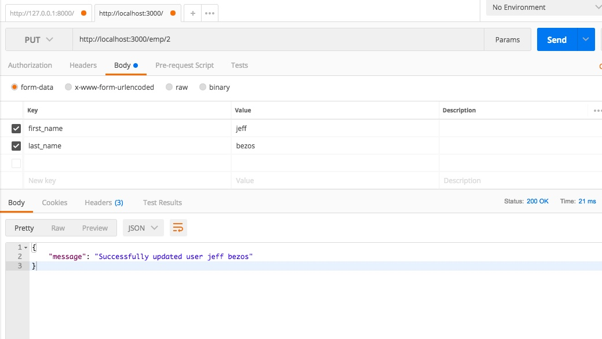
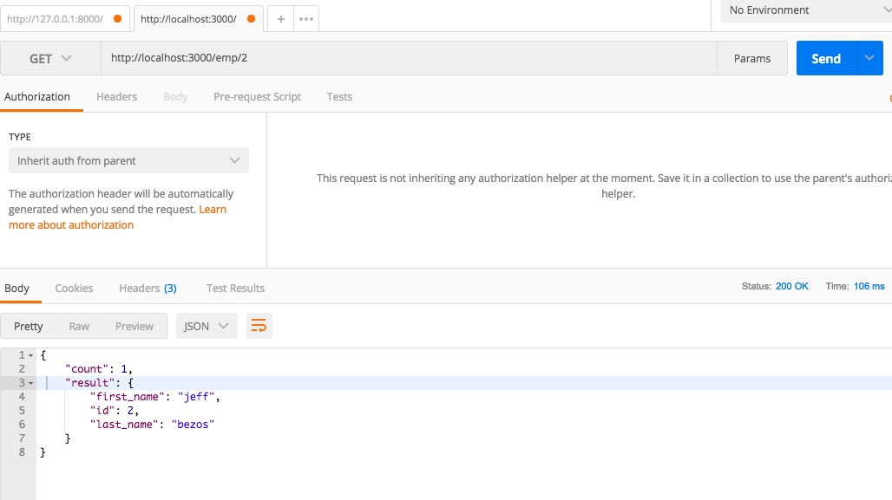

Building a RESTful API Server with Golang and MySQL

1. migrate.go: Establishes Database Connection and Creates tables.
2. base.go: Contains all the API Handles.

The API serves requests as below:

PUT:

GET:
